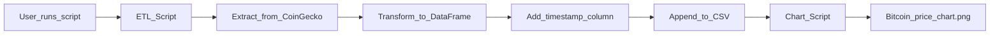

## Crypto Data Pipeline

 I built this project as a **beginner-friendly data engineering exercise**. It’s a small Python ETL pipeline that collects daily cryptocurrency prices (Bitcoin and Ethereum) from the **CoinGecko API**, stores them in a CSV file, and generates a Bitcoin price trend chart.

The goal is to demonstrate a simple **ETL (Extract–Transform–Load)** workflow using Python, `pandas`, and `matplotlib`.

---

## Project Structure

- `data/`  
  Stores the CSV file with historical cryptocurrency prices.
  - `crypto_prices.csv` – created/updated by the ETL script.

- `scripts/`  
  Contains the Python scripts that implement the pipeline.
  - `etl_crypto_prices.py` – main ETL script:
    - Extracts Bitcoin and Ethereum prices from CoinGecko.
    - Transforms the data into a `pandas.DataFrame` with a timestamp.
    - Appends the records into `data/crypto_prices.csv`.
  - `plot_bitcoin_trend.py` – visualization script:
    - Reads `data/crypto_prices.csv`.
    - Filters Bitcoin prices.
    - Generates a line chart and saves it to `charts/bitcoin_price_trend.png`.

- `charts/`  
  Contains generated charts.
  - `bitcoin_price_trend.png` – created by `plot_bitcoin_trend.py`.

- `requirements.txt`  
  Lists the Python dependencies required to run the project.

---

## Setup

### 1. Prerequisites

- Python 3.10+ (any recent 3.x version should work)
- `pip` for installing Python packages

### 2. Install Dependencies

From the project root (where `requirements.txt` is located), run:

```bash
pip install -r requirements.txt
```

This installs:

- `requests` – to call the CoinGecko API.
- `pandas` – to work with tabular data (DataFrame).
- `matplotlib` – to create the Bitcoin price chart.

---

## Running the ETL Pipeline

The ETL script:

1. **Extracts** Bitcoin and Ethereum prices (in USD) from the CoinGecko API.
2. **Transforms** the response into a tidy `pandas.DataFrame` with:
   - `timestamp` – when the data was fetched (UTC).
   - `coin` – the coin name (`bitcoin` or `ethereum`).
   - `price_usd` – price in US dollars.
3. **Loads** (appends) the rows into `data/crypto_prices.csv`.

From the project root, run:

```bash
python scripts/etl_crypto_prices.py
```

After running:

- If `data/crypto_prices.csv` does not exist, it will be **created** with a header.
- If it already exists, new rows will be **appended** without duplicating the header.

I run this script once per day (or as often) to slowly build up my historical price dataset.

---

## Generating the Bitcoin Price Trend Chart

Once I have some data in `data/crypto_prices.csv`, I generate a **Bitcoin price trend chart**.

From the project root, run:

```bash
python scripts/plot_bitcoin_trend.py
```

The script will:

1. Read `data/crypto_prices.csv` using `pandas`.
2. Filter rows where `coin == "bitcoin"`.
3. Parse the `timestamp` column into proper datetime objects.
4. Sort the records by time.
5. Plot **timestamp vs. `price_usd`** using `matplotlib`.
6. Save the chart to:

```text
charts/bitcoin_price_trend.png
```

If the CSV is missing or there is no Bitcoin data, the script will raise a clear error message explaining what to fix.

---

## ETL Architecture Overview

At a high level, the pipeline follows a simple ETL flow.



### Components

- **Extract** (`scripts/etl_crypto_prices.py` – `fetch_prices` function)
  - Calls the CoinGecko Simple Price API:
    - Endpoint: `https://api.coingecko.com/api/v3/simple/price`
    - Coins: `bitcoin`, `ethereum`
    - Currency: `usd`
  - Handles basic HTTP errors and JSON parsing.

- **Transform** (`scripts/etl_crypto_prices.py` – `transform_to_dataframe` function)
  - Converts the API response into rows like:
    - `timestamp`: ISO8601 formatted UTC timestamp.
    - `coin`: `"bitcoin"` or `"ethereum"`.
    - `price_usd`: float price in USD.

- **Load** (`scripts/etl_crypto_prices.py` – `append_to_csv` function)
  - Appends the DataFrame to `data/crypto_prices.csv`.
  - Creates the file and folder if they do not exist.

- **Visualization** (`scripts/plot_bitcoin_trend.py`)
  - Loads the CSV.
  - Filters for Bitcoin.
  - Produces the chart in `charts/bitcoin_price_trend.png`.

---

## How to Extend This Project

This is just a starting point for me. Here are some directions I might take it:

- **Scheduling**  
  - Use Windows Task Scheduler (on Windows) or `cron` (on Linux/macOS) to run:
    - `python scripts/etl_crypto_prices.py` once per day.

- **More Coins / Currencies**  
  - Add more coin IDs (e.g., `litecoin`, `cardano`) or track prices in other fiat currencies.

- **Database Storage**  
  - Instead of writing to CSV, load data into a relational database (e.g., SQLite, PostgreSQL) for more advanced querying.

- **Dashboards**  
  - Build a simple dashboard using tools like Streamlit or a BI tool to visualize trends interactively.

This project is my way of learning ETL fundamentals with a real-world dataset that I find interesting.

